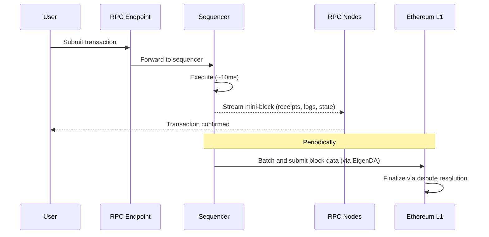

# Architecture

MegaETH is an Ethereum L2 built on the [OP Stack](https://docs.optimism.io/stack/getting-started), optimized for real-time execution.
The sequencer produces [mini-blocks](mini-block.md) every ~10 milliseconds and [EVM blocks](mini-block.md) every ~1 second, streaming state to globally distributed RPC nodes so that users and applications see transaction results within milliseconds.

## How a Transaction Moves Through MegaETH

Like all blockchains, MegaETH processes transactions and maintains a shared ledger.
What makes it different is *speed*: a transaction is confirmed in roughly 10 milliseconds — not seconds or minutes.
The rest of this page walks through exactly how that happens, from submission to final settlement on Ethereum L1.

### 1. Submission

A user's transaction — a swap, a transfer, a contract call — arrives at an RPC endpoint.
The endpoint validates it (correct format, valid signature, sufficient balance) and forwards it to the [sequencer](https://docs.optimism.io/connect/resources/glossary#sequencer), the single node responsible for ordering and executing transactions.

### 2. Execution

The sequencer executes the transaction against the current chain state.
Every ~10 milliseconds, it seals the recently executed transactions into a [mini-block](mini-block.md) — a lightweight block containing the transactions, their execution results (receipts), and the resulting state changes.

### 3. Streaming

The sequencer streams each mini-block to RPC nodes distributed across multiple regions.
As soon as an RPC node receives a mini-block, its contents — transaction receipts, event logs, and state updates — become immediately queryable.
This is how a wallet can show a confirmed transaction within milliseconds: the RPC node it connects to has already received the mini-block containing the result.

Applications that need the lowest possible latency can subscribe to mini-blocks directly via the [Realtime API](dev/read/realtime-api.md).

### 4. L1 Settlement

Periodically, the sequencer seals an [EVM block](mini-block.md#relationship-to-evm-blocks) — a standard Ethereum-format block that bundles all the mini-blocks produced during that interval.
The block data is posted to [EigenDA](https://docs.eigenlayer.xyz/eigenda/overview/) for [data availability](https://docs.optimism.io/connect/resources/glossary#data-availability).
EigenDA returns a certificate proving the data is available, and the OP Stack [batcher](https://docs.optimism.io/builders/chain-operators/architecture#batcher) submits that certificate to Ethereum L1.
Block proposals can then be challenged through [dispute resolution](https://specs.optimism.io/fault-proof/index.html).

This is what gives MegaETH its security: even though the sequencer processes transactions at sub-second speed, all results are ultimately anchored to Ethereum and can be independently verified.

## Components

### Sequencer

The [sequencer](https://docs.optimism.io/connect/resources/glossary#sequencer) is the block producer — the single node that decides transaction ordering.
It executes transactions, assembles them into mini-blocks and EVM blocks, and broadcasts execution results to the rest of the network.

The sequencer is operated with high availability.
If the active node goes down, a standby takes over within seconds, and software upgrades happen without pausing the chain.

### RPC Nodes

RPC nodes are the network's public interface.
They serve read requests (account balances, contract calls, event logs), accept transaction submissions, and maintain a full replica of the chain state, synced from the sequencer via a streaming protocol.

MegaETH operates RPC nodes across multiple geographic regions so that users worldwide connect to a nearby node with low latency.
There are two ways to access them (see [Connect to MegaETH](user/connect.md) for endpoints):

- **Public RPC endpoint** — available to everyone, rate-limited.
- **Managed RPC providers** — [Alchemy](https://www.alchemy.com/) and others offer higher throughput and debug methods (`debug_*`, `trace_*`).

### Data Availability

When the sequencer produces a block, it must make the block data publicly available so that anyone can verify the chain — this is the [data availability](https://docs.optimism.io/connect/resources/glossary#data-availability) requirement.
MegaETH uses [EigenDA](https://www.eigenlayer.xyz/) as the primary data availability layer.
Without a DA certificate, the sequencer cannot submit the block to L1.
This ensures that even if the sequencer behaves maliciously, replica nodes and provers can always access the data they need.

### Fault Proof

MegaETH settles on Ethereum L1 using the OP Stack's [dispute resolution](https://specs.optimism.io/fault-proof/index.html) framework.
Block proposals are submitted to L1 and can be challenged within a dispute window.

For dispute resolution, MegaETH uses **Kailua** — a ZK fraud proof system built on RISC-Zero.
Instead of the multi-round interactive bisection used by standard OP Stack, Kailua generates a single zero-knowledge proof to resolve disputes, making challenges faster and cheaper.

## Related Pages

- [Get Started](user/get-started.md) — connect your wallet, bridge ETH, and explore the network
- [Connect to MegaETH](user/connect.md) — chain IDs, RPC endpoints, and network parameters
- [Mini-Blocks](mini-block.md) — the two block types and how they enable sub-second latency
- [Overview](dev/overview.md) — developer quickstart with RPC endpoints and chain configuration
- [Realtime API](dev/read/realtime-api.md) — subscribe to mini-blocks and get results in real time
